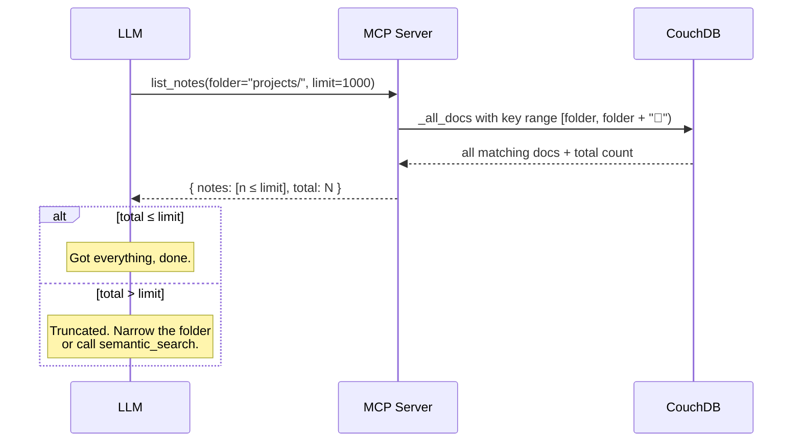
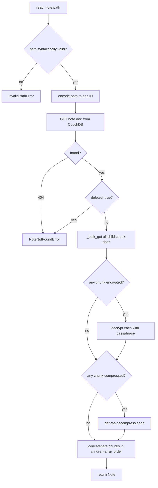

# Obsidian LiveSync MCP Server — Design

A Python-based MCP (Model Context Protocol) server that lets an LLM interact
with an Obsidian vault stored in a CouchDB database managed by the
[Obsidian LiveSync](https://github.com/vrtmrz/obsidian-livesync) plugin.

The server acts as a standalone client to the same CouchDB the plugin syncs
against. From the database's perspective, the MCP server is just another
LiveSync peer — but instead of a user editing notes in Obsidian, an LLM is
reading and modifying them through MCP tools.

## Goals

- Let an LLM browse, read, search, create, update, and delete notes in an
  Obsidian vault without going through Obsidian itself.
- Provide semantic (vector) search over the vault so the LLM can find
  relevant content quickly, with the index maintained server-side via the
  CouchDB `_changes` feed.
- Stay protocol-clean: no Obsidian dependency, no plugin code reused — only
  the LiveSync data schema is mirrored.

## Non-goals

- Real-time multi-peer conflict resolution. Conflicts will be detected and
  surfaced, but the server is not a full LiveSync replication node.
- Two-way Obsidian plugin integration. The server reads/writes the database
  directly.
- Hosting/managing the CouchDB instance. The user supplies connection info.

---

## Conflict semantics

CouchDB uses optimistic concurrency: every write must include the current
`_rev`, and stale writes are rejected with HTTP 409. Our server treats the
database as a normal MVCC store and **does not implement any merge logic**.
The existing LiveSync plugin on the user's devices already handles
resolution.

### What the server does

- **Read-modify-write with retry-on-409.** For every update we GET the
  doc, mutate it, PUT with the current `_rev`. If we get 409, re-fetch
  and retry (cap at a small number of retries, e.g. 3).
- **Set `mtime` correctly.** The auto-merger uses `mtime` to order
  concurrent inserts and to break ties in JSON merges, so every write
  stamps `mtime` with the current millisecond timestamp. Preserve
  `ctime` from the existing doc on updates.
- **Treat soft-deletes as terminal.** A read of a doc with
  `deleted: true` returns `None` (note not found). Writes recreate it.

### What the server does *not* do

- **No three-way merging.** Even though we know how LiveSync does it (see
  reference below), we don't reimplement it. Our writes are atomic from
  CouchDB's perspective.
- **No conflict creation by us alone.** A single client doing
  read-modify-write cannot create a `_conflicts` entry — conflicts only
  arise from replication. If the LiveSync plugin on a device later
  syncs a divergent edit of a doc we wrote, CouchDB populates
  `_conflicts`, and the *plugin's* `ConflictManager.tryAutoMerge` runs
  on the next replication pass on the user's device.
- **No interactive resolution.** If auto-merge fails on the device, the
  user is prompted in Obsidian, exactly as they would be today.

### Reference

- `src/lib/src/managers/ConflictManager.ts` — three-way merge and
  per-line/per-key collision detection.
- `src/modules/core/ReplicateResultProcessor.ts` — where conflicts are
  picked up off the replication stream.

---

## Requirements

This is the running source of truth for what the server should do. Items
are tagged with status: `[ ]` planned, `[~]` in progress, `[x]` complete.

The MCP surface is intentionally small — **7 tools total**. Every tool
description occupies LLM context, and tighter tool sets produce better
tool-selection behavior. Internal state (indexing progress, encryption,
chunking, etc.) is deliberately hidden from the LLM; it shows up only
where it materially affects results.

### MCP tools — notes (CRUD)

- [ ] `list_notes(path_prefix?, limit?)` — list note paths in the vault.
      Supports prefix filter for folder-style browsing.
- [ ] `read_note(path)` — read full markdown content of a note. Handles
      chunk reassembly, decompression, and decryption transparently.
- [ ] `create_note(path, content)` — create a new note. Fails if the path
      already exists.
- [ ] `update_note(path, content)` — overwrite the content of an existing
      note. Handles chunking + metadata updates.
- [ ] `delete_note(path)` — soft-delete a note (sets `deleted: true`).
- [ ] `move_note(old_path, new_path)` — rename/move a note. Atomic from
      the caller's perspective; may be read + create + delete under the
      hood.

### MCP tools — search

- [ ] `semantic_search(query, top_k?, path_filter?)` — vector similarity
      search over indexed note chunks. Response includes an
      `index_coverage: {indexed, total}` field so the caller can tell
      "no matches" from "index not yet built".

### LiveSync schema support

- [ ] CouchDB connection (basic auth + TLS).
- [ ] Path → document ID encoding (plain mode).
- [ ] Path → document ID encoding (obfuscated `f:` mode, SHA-256 stretched).
- [ ] Chunk reassembly from `children[]` references.
- [ ] Note write path: content splitting, chunk hashing (`h:` IDs), parent
      doc with `children[]` and `eden` field.
- [ ] Soft-delete via `deleted: true`.
- [ ] Compression / decompression (fflate / deflate, `~` marker).
- [ ] Encryption V2 (HKDF, `%=` marker) — read.
- [ ] Encryption V2 (HKDF) — write.
- [ ] Encryption V1 (PBKDF2, `%` marker) — read. *(legacy, may skip)*

### Vector index

The index runs continuously in the background and is never directly
visible to the LLM. The only place its state leaks into the API is the
`index_coverage` field of `semantic_search` responses.

- [ ] Background subscriber to CouchDB `_changes` feed (`since=<saved>`,
      `feed=continuous`).
- [ ] On change: fetch updated note, chunk for embedding, embed, upsert
      into vector store.
- [ ] On delete: remove vectors for that note from the store.
- [ ] Pluggable embedding backend (OpenAI, local sentence-transformers,
      Ollama, etc.) selected via config.
- [ ] Pluggable vector store (initial choice TBD — Chroma, Qdrant, sqlite-vec,
      LanceDB are candidates).
- [ ] Persistent watermark of last-seen `_changes` sequence so the indexer
      can resume cleanly across restarts.
- [ ] Initial backfill on first start (or when index is empty).
- [ ] Admin CLI command for forced full reindex (operator action, **not**
      an MCP tool).

### Tooling & dev experience

- [x] uv-managed Python project.
- [x] pytest + pytest-asyncio test scaffolding.
- [x] ruff for lint + format.
- [ ] mypy or pyright type-checking in CI.
- [ ] GitHub Actions: lint, type-check, test on push/PR.
- [ ] Docker image for running the server.

---

## API reference

Detailed input/output schemas for each MCP tool. Field descriptions here
are normative — the MCP SDK translates these Pydantic models into a JSON
Schema that the LLM sees verbatim, so wording matters.

### Cross-cutting conventions

- **Schema mechanism:** Pydantic models. The MCP Python SDK auto-generates
  JSON Schema from them.
- **Timestamps:** ISO 8601 strings, UTC (e.g. `"2026-05-14T10:30:00Z"`).
  LiveSync stores unix-ms internally; we convert at the boundary.
- **Errors:** typed exceptions, surfaced as structured MCP tool errors.
  Common ones:
  - `NoteNotFoundError` — path doesn't exist or is soft-deleted.
  - `NoteAlreadyExistsError` — path already exists when it shouldn't.
  - `InvalidPathError` — path malformed (empty, contains `..`, leading `/`,
    etc.).
- **Paths:** plain `str`, forward slashes, case-sensitive, relative to vault
  root. No leading slash. Must end in `.md` for create operations.
- **Shared `Note` model:** the return type for `read_note`, `create_note`,
  `update_note`, and `move_note`.

```python
class Note(BaseModel):
    """A note's full content and metadata."""

    path: str = Field(description="Path of the note (echoed from input).")
    content: str = Field(
        description=(
            "Full markdown content as UTF-8 text. "
            "Includes any YAML frontmatter at the top, verbatim. "
            "Whitespace and line endings preserved as stored."
        ),
    )
    ctime: datetime = Field(description="Creation time (ISO 8601, UTC).")
    mtime: datetime = Field(
        description="Last modification time (ISO 8601, UTC).",
    )
    size_bytes: int = Field(
        ge=0,
        description="Plaintext size of the note in bytes (UTF-8).",
    )
```

### `list_notes`

Browse notes in the vault, optionally scoped to a folder. Intentionally
**not paginated** — most folders contain few enough notes to return in
one call, and the LLM's primary discovery tool for large vaults is
`semantic_search` anyway. If a folder is genuinely larger than the
limit, the LLM should narrow its filter or switch to semantic search
rather than iterate.

```python
class ListNotesInput(BaseModel):
    """List notes in the vault, optionally scoped to a folder."""

    folder: str | None = Field(
        default=None,
        description=(
            "Optional folder to list notes from, recursively. "
            "Examples: 'projects/', 'daily/2026/'. A trailing slash is "
            "added if missing. Null or empty means list from the vault root. "
            "Paths are case-sensitive and use forward slashes."
        ),
    )
    limit: int = Field(
        default=1000,
        ge=1,
        le=5000,
        description=(
            "Maximum notes to return. Defaults to 1000; cap is 5000. "
            "If you hit the limit and need more, narrow the folder filter "
            "or use semantic_search instead of trying to enumerate."
        ),
    )


class NoteListItem(BaseModel):
    """A single note's summary for listing."""

    path: str = Field(
        description=(
            "File path relative to the vault root. "
            "Examples: 'README.md', 'daily/2026-05-14.md'."
        ),
    )
    mtime: datetime = Field(
        description="Last modification time (ISO 8601, UTC).",
    )
    size_bytes: int = Field(
        ge=0,
        description="Plaintext size of the note in bytes.",
    )


class ListNotesOutput(BaseModel):
    """Notes matching the filter, ordered lexicographically by path."""

    notes: list[NoteListItem] = Field(
        description=(
            "Matching notes, sorted by path (case-sensitive lexicographic). "
            "May be truncated to `limit` items — check `total` to know."
        ),
    )
    total: int = Field(
        ge=0,
        description=(
            "Total notes matching the folder filter (independent of limit). "
            "If total > len(notes), the result was truncated. "
            "Narrow the folder or use semantic_search to find what you need."
        ),
    )
```

**Errors:** none. Empty `notes` array if nothing matches.



### `read_note`

Fetch a single note's full content. Notes are typically 1-20 KB in
Obsidian; partial-read parameters are intentionally omitted because the
edge case (multi-megabyte notes) is rare and would add complexity to
every call.

```python
class ReadNoteInput(BaseModel):
    """Read a single note's full content by path."""

    path: str = Field(
        description=(
            "Path to the note relative to the vault root. "
            "Examples: 'README.md', 'daily/2026-05-14.md'. "
            "Paths are case-sensitive and use forward slashes."
        ),
    )
```

**Output:** the shared `Note` model.

**Errors:**
- `NoteNotFoundError` — path doesn't exist or is soft-deleted (the LLM
  cannot distinguish these cases; both look like "no note here").
- `InvalidPathError` — path is malformed.

**Safety net (internal):** a runtime cap (e.g. 5 MB) refuses to return
unreasonably large notes to protect server memory. Not part of the
public API; surfaces as a clear error if ever hit.

**Read flow (internal):**



### `create_note`

*(API definition pending — to be filled in.)*

### `update_note`

*(API definition pending — to be filled in.)*

### `delete_note`

*(API definition pending — to be filled in.)*

### `move_note`

*(API definition pending — to be filled in.)*

### `semantic_search`

*(API definition pending — to be filled in.)*

---

## Architecture sketch

```
                                          ┌─────────────────────────┐
                                          │       MCP client        │
                                          │  (Claude Desktop, etc.) │
                                          └────────────┬────────────┘
                                                       │  MCP (stdio/http)
                                          ┌────────────▼────────────┐
                                          │   obsidian_livesync_mcp │
                                          │  ┌───────────────────┐  │
                                          │  │   server.py       │  │  ← MCP entry
                                          │  └─────────┬─────────┘  │
                                          │  ┌─────────▼─────────┐  │
                                          │  │   tools/          │  │  ← MCP tool handlers
                                          │  └─────────┬─────────┘  │
                                          │  ┌─────────▼─────────┐  │
                                          │  │  livesync/        │  │  ← schema, chunks,
                                          │  │   paths, chunks,  │  │     encryption, paths
                                          │  │   notes, crypto   │  │
                                          │  └─────────┬─────────┘  │
                                          │  ┌─────────▼─────────┐  │
                                          │  │   couchdb.py      │  │  ← HTTP client
                                          │  └─────────┬─────────┘  │
                                          └────────────┼────────────┘
                                                       │  HTTP
                                          ┌────────────▼────────────┐
                                          │        CouchDB          │
                                          │  (the LiveSync database)│
                                          └─────────────────────────┘

                                  ┌──────────────────┐
                                  │   vector/        │
                                  │   indexer.py     │  subscribes to _changes,
                                  │   store.py       │  writes to vector DB
                                  └──────────────────┘
```

## Deferred / backburner

- **Local read cache.** A small SQLite cache keyed by `(path, rev)` storing
  decoded note content would skip the chunk-fetch + decompress + decrypt
  pipeline on repeated reads. Mostly worthwhile when the MCP server runs
  on a different machine from CouchDB and round-trip latency is non-trivial;
  for a co-located deployment the savings are negligible. Revisit if
  profiling shows reads are a bottleneck.
- **PouchDB-style local replica.** Explicitly rejected: PouchDB is JS-only,
  bridging it from Python is expensive, and we don't need the offline /
  conflict-resolution features it provides. A targeted cache (above) covers
  the realistic performance need.

## Open questions

- **Vector store choice.** Embedded (sqlite-vec, Chroma persistent, LanceDB)
  is simpler for self-hosting; server (Qdrant, Weaviate) scales better.
  Default to embedded; make it pluggable.
- **Embedding backend default.** OpenAI's `text-embedding-3-small` is cheap
  and good, but requires an API key. A local default (sentence-transformers
  or Ollama) avoids that but adds heavy dependencies. Probably ship without
  a default and require explicit config.
- **Chunking granularity for embeddings.** Per-note? Per-heading section?
  Per-paragraph with overlap? Probably per-heading with a fallback to
  fixed-size windows for long sections.
- **Write-side LiveSync compatibility.** Our writes need to be readable by
  the official LiveSync plugin without trouble. This means matching their
  `eden` field semantics and chunk hashing exactly. To be verified with
  round-trip tests against a real vault.
- **Search-while-indexing.** What does `semantic_search` return if the
  index is incomplete? Probably: include a `coverage` field in the
  response so the LLM knows.

## Reference

- The TypeScript source under `src/lib/` (the `livesync-commonlib`
  submodule) is the canonical reference for the on-disk schema.
- Key files when in doubt:
  - `src/lib/src/common/models/db.type.ts` — document type definitions.
  - `src/lib/src/string_and_binary/path.ts` — path ↔ ID encoding.
  - `src/lib/src/pouchdb/encryption.ts` — encryption.
  - `src/lib/src/ContentSplitter/` — chunking.
  - `src/lib/src/managers/EntryManager/EntryManagerImpls.ts` — read/write
    note assembly logic.
