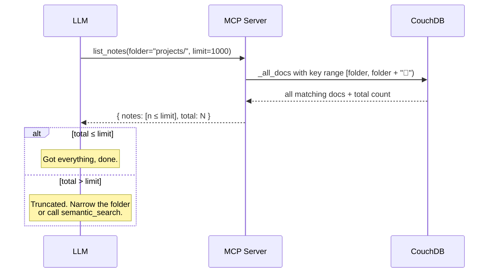
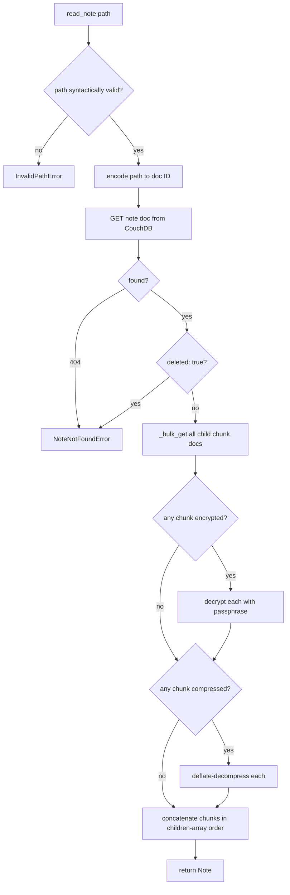
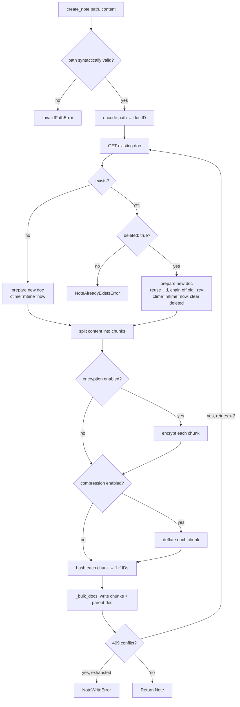
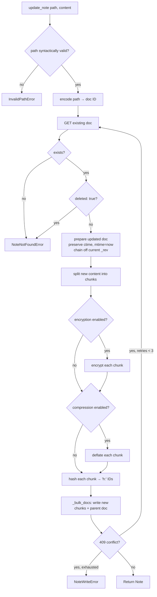
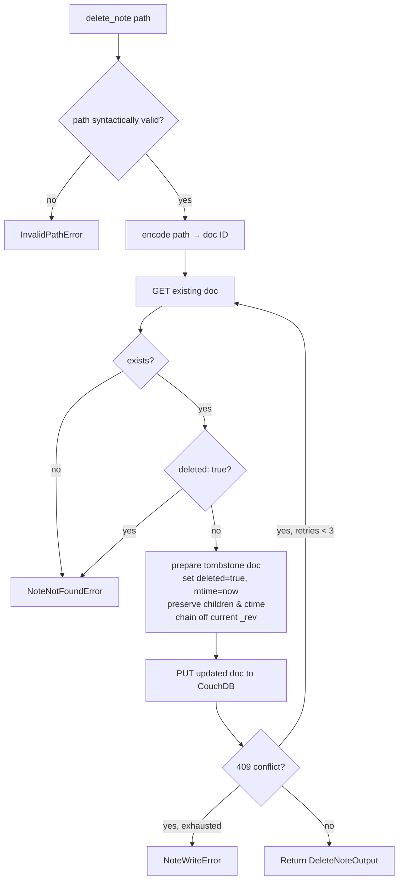
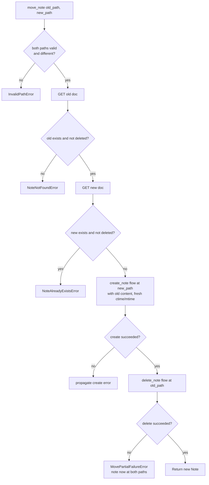
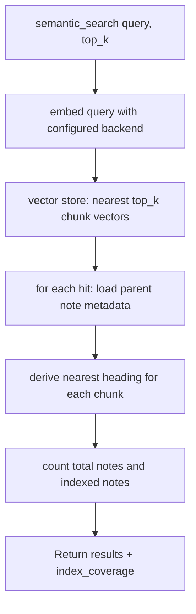

# Obsidian LiveSync MCP Server — Design

A Python-based MCP (Model Context Protocol) server that lets an LLM interact
with an Obsidian vault stored in a CouchDB database managed by the
[Obsidian LiveSync](https://github.com/vrtmrz/obsidian-livesync) plugin.

The server acts as a standalone client to the same CouchDB the plugin syncs
against. From the database's perspective, the MCP server is just another
LiveSync peer — but instead of a user editing notes in Obsidian, an LLM is
reading and modifying them through MCP tools.

## Goals

- Let an LLM browse, read, search, create, update, and delete notes in an
  Obsidian vault without going through Obsidian itself.
- Provide semantic (vector) search over the vault so the LLM can find
  relevant content quickly, with the index maintained server-side via the
  CouchDB `_changes` feed.
- Stay protocol-clean: no Obsidian dependency, no plugin code reused — only
  the LiveSync data schema is mirrored.

## Non-goals

- Real-time multi-peer conflict resolution. Conflicts will be detected and
  surfaced, but the server is not a full LiveSync replication node.
- Two-way Obsidian plugin integration. The server reads/writes the database
  directly.
- Hosting/managing the CouchDB instance. The user supplies connection info.

---

## Conflict semantics

CouchDB uses optimistic concurrency: every write must include the current
`_rev`, and stale writes are rejected with HTTP 409. Our server treats the
database as a normal MVCC store and **does not implement any merge logic**.
The existing LiveSync plugin on the user's devices already handles
resolution.

### What the server does

- **Read-modify-write with retry-on-409.** For every update we GET the
  doc, mutate it, PUT with the current `_rev`. If we get 409, re-fetch
  and retry (cap at a small number of retries, e.g. 3).
- **Set `mtime` correctly.** The auto-merger uses `mtime` to order
  concurrent inserts and to break ties in JSON merges, so every write
  stamps `mtime` with the current millisecond timestamp. Preserve
  `ctime` from the existing doc on updates.
- **Treat soft-deletes as terminal.** A read of a doc with
  `deleted: true` returns `None` (note not found). Writes recreate it.

### What the server does *not* do

- **No three-way merging.** Even though we know how LiveSync does it (see
  reference below), we don't reimplement it. Our writes are atomic from
  CouchDB's perspective.
- **No conflict creation by us alone.** A single client doing
  read-modify-write cannot create a `_conflicts` entry — conflicts only
  arise from replication. If the LiveSync plugin on a device later
  syncs a divergent edit of a doc we wrote, CouchDB populates
  `_conflicts`, and the *plugin's* `ConflictManager.tryAutoMerge` runs
  on the next replication pass on the user's device.
- **No interactive resolution.** If auto-merge fails on the device, the
  user is prompted in Obsidian, exactly as they would be today.

### Reference

- `src/lib/src/managers/ConflictManager.ts` — three-way merge and
  per-line/per-key collision detection.
- `src/modules/core/ReplicateResultProcessor.ts` — where conflicts are
  picked up off the replication stream.

---

## Requirements

This is the running source of truth for what the server should do. Items
are tagged with status: `[ ]` planned, `[~]` in progress, `[x]` complete.

The MCP surface is intentionally small — **7 tools total**. Every tool
description occupies LLM context, and tighter tool sets produce better
tool-selection behavior. Internal state (indexing progress, encryption,
chunking, etc.) is deliberately hidden from the LLM; it shows up only
where it materially affects results.

### MCP tools — notes (CRUD)

- [x] `list_notes(folder?, limit?)` — list note paths in the vault.
      Supports prefix filter for folder-style browsing.
- [x] `read_note(path)` — read full markdown content of a note. Handles
      chunk reassembly + decompression. Encryption raises a clear error.
- [x] `create_note(path, content)` — create a new note. Fails if the path
      already exists.
- [x] `update_note(path, content)` — overwrite the content of an existing
      note. Handles chunking + metadata updates.
- [x] `delete_note(path)` — soft-delete a note (sets `deleted: true`).
- [x] `move_note(old_path, new_path)` — rename/move a note. Atomic from
      the caller's perspective; create-then-delete under the hood.

### MCP tools — search

- [~] `semantic_search(query, top_k?)` — vector similarity search over
      indexed note chunks. Response includes an `index_coverage:
      {indexed, total}` field so the caller can tell "no matches" from
      "index not yet built". No folder filter in v1.
      **MVP: stub** — returns empty results with honest coverage stats
      reflecting no index built. Full implementation needs vector store
      + embedding backend + `_changes` subscriber.

### LiveSync schema support

- [x] CouchDB connection (basic auth + TLS).
- [x] Path → document ID encoding (plain mode).
- [x] Path → document ID encoding (obfuscated `f:` mode, SHA-256 stretched).
      *(Implemented; needs real-vault verification — see Known gaps.)*
- [x] Chunk reassembly from `children[]` references.
- [x] Note write path: content splitting, chunk hashing (`h:` IDs via
      XXHash64 + base36), parent doc with `children[]` and empty `eden` field.
- [x] Soft-delete via `deleted: true`.
- [x] Compression / decompression (deflate via stdlib `zlib`, `~` marker).
- [ ] Encryption V2 (HKDF, `%=` marker) — read. *(MVP: not supported.)*
- [ ] Encryption V2 (HKDF) — write. *(MVP: not supported.)*
- [ ] Encryption V1 (PBKDF2, `%` marker) — read. *(legacy, may skip)*

### Vector index

The index runs continuously in the background and is never directly
visible to the LLM. The only place its state leaks into the API is the
`index_coverage` field of `semantic_search` responses.

- [ ] Background subscriber to CouchDB `_changes` feed (`since=<saved>`,
      `feed=continuous`).
- [ ] On change: fetch updated note, chunk for embedding, embed, upsert
      into vector store.
- [ ] On delete: remove vectors for that note from the store.
- [ ] Pluggable embedding backend (OpenAI, local sentence-transformers,
      Ollama, etc.) selected via config.
- [ ] Pluggable vector store (initial choice TBD — Chroma, Qdrant, sqlite-vec,
      LanceDB are candidates).
- [ ] Persistent watermark of last-seen `_changes` sequence so the indexer
      can resume cleanly across restarts.
- [ ] Initial backfill on first start (or when index is empty).
- [ ] Admin CLI command for forced full reindex (operator action, **not**
      an MCP tool).

### Tooling & dev experience

- [x] uv-managed Python project.
- [x] pytest + pytest-asyncio test scaffolding.
- [x] ruff for lint + format.
- [x] mypy type-checking in CI.
- [x] GitHub Actions: lint, format, type-check, test on push/PR
      (path-filtered to `mcp_server/**`).
- [ ] Docker image for running the server.

---

## API reference

Detailed input/output schemas for each MCP tool. Field descriptions here
are normative — the MCP SDK translates these Pydantic models into a JSON
Schema that the LLM sees verbatim, so wording matters.

### Cross-cutting conventions

- **Schema mechanism:** Pydantic models. The MCP Python SDK auto-generates
  JSON Schema from them.
- **Timestamps:** ISO 8601 strings, UTC (e.g. `"2026-05-14T10:30:00Z"`).
  LiveSync stores unix-ms internally; we convert at the boundary.
- **Errors:** typed exceptions, surfaced as structured MCP tool errors.
  Common ones:
  - `NoteNotFoundError` — path doesn't exist or is soft-deleted.
  - `NoteAlreadyExistsError` — path already exists when it shouldn't.
  - `InvalidPathError` — path malformed (empty, contains `..`, leading `/`,
    etc.).
- **Paths:** plain `str`, forward slashes, case-sensitive, relative to vault
  root. No leading slash. Must end in `.md` for create operations.
- **Shared `Note` model:** the return type for `read_note`, `create_note`,
  `update_note`, and `move_note`.

```python
class Note(BaseModel):
    """A note's full content and metadata."""

    path: str = Field(description="Path of the note (echoed from input).")
    content: str = Field(
        description=(
            "Full markdown content as UTF-8 text. "
            "Includes any YAML frontmatter at the top, verbatim. "
            "Whitespace and line endings preserved as stored."
        ),
    )
    ctime: datetime = Field(description="Creation time (ISO 8601, UTC).")
    mtime: datetime = Field(
        description="Last modification time (ISO 8601, UTC).",
    )
    size_bytes: int = Field(
        ge=0,
        description="Plaintext size of the note in bytes (UTF-8).",
    )
```

### `list_notes`

Browse notes in the vault, optionally scoped to a folder. Intentionally
**not paginated** — most folders contain few enough notes to return in
one call, and the LLM's primary discovery tool for large vaults is
`semantic_search` anyway. If a folder is genuinely larger than the
limit, the LLM should narrow its filter or switch to semantic search
rather than iterate.

```python
class ListNotesInput(BaseModel):
    """List notes in the vault, optionally scoped to a folder."""

    folder: str | None = Field(
        default=None,
        description=(
            "Optional folder to list notes from, recursively. "
            "Examples: 'projects/', 'daily/2026/'. A trailing slash is "
            "added if missing. Null or empty means list from the vault root. "
            "Paths are case-sensitive and use forward slashes."
        ),
    )
    limit: int = Field(
        default=1000,
        ge=1,
        le=5000,
        description=(
            "Maximum notes to return. Defaults to 1000; cap is 5000. "
            "If you hit the limit and need more, narrow the folder filter "
            "or use semantic_search instead of trying to enumerate."
        ),
    )


class NoteListItem(BaseModel):
    """A single note's summary for listing."""

    path: str = Field(
        description=(
            "File path relative to the vault root. "
            "Examples: 'README.md', 'daily/2026-05-14.md'."
        ),
    )
    mtime: datetime = Field(
        description="Last modification time (ISO 8601, UTC).",
    )
    size_bytes: int = Field(
        ge=0,
        description="Plaintext size of the note in bytes.",
    )


class ListNotesOutput(BaseModel):
    """Notes matching the filter, ordered lexicographically by path."""

    notes: list[NoteListItem] = Field(
        description=(
            "Matching notes, sorted by path (case-sensitive lexicographic). "
            "May be truncated to `limit` items — check `total` to know."
        ),
    )
    total: int = Field(
        ge=0,
        description=(
            "Total notes matching the folder filter (independent of limit). "
            "If total > len(notes), the result was truncated. "
            "Narrow the folder or use semantic_search to find what you need."
        ),
    )
```

**Errors:** none. Empty `notes` array if nothing matches.



### `read_note`

Fetch a single note's full content. Notes are typically 1-20 KB in
Obsidian; partial-read parameters are intentionally omitted because the
edge case (multi-megabyte notes) is rare and would add complexity to
every call.

```python
class ReadNoteInput(BaseModel):
    """Read a single note's full content by path."""

    path: str = Field(
        description=(
            "Path to the note relative to the vault root. "
            "Examples: 'README.md', 'daily/2026-05-14.md'. "
            "Paths are case-sensitive and use forward slashes."
        ),
    )
```

**Output:** the shared `Note` model.

**Errors:**
- `NoteNotFoundError` — path doesn't exist or is soft-deleted (the LLM
  cannot distinguish these cases; both look like "no note here").
- `InvalidPathError` — path is malformed.

**Safety net (internal):** a runtime cap (e.g. 5 MB) refuses to return
unreasonably large notes to protect server memory. Not part of the
public API; surfaces as a clear error if ever hit.

**Read flow (internal):**



### `create_note`

Create a new note. Fails if a non-deleted note already exists at the path.
A soft-deleted note at the path is silently overwritten (resurrected),
matching the LiveSync plugin's own behavior.

```python
class CreateNoteInput(BaseModel):
    """Create a new note. Fails if a live note already exists at the path."""

    path: str = Field(
        description=(
            "Path where the new note will be created, relative to vault root. "
            "Must end in '.md'. Must not already exist (a soft-deleted note "
            "at the same path is fine — it will be transparently overwritten). "
            "Parent folders are implicit; writing 'projects/new/notes.md' "
            "works even if 'projects/new/' is otherwise empty. "
            "Forward slashes only, case-sensitive."
        ),
    )
    content: str = Field(
        description=(
            "Initial markdown content of the note. May be empty. "
            "May include YAML frontmatter at the top. "
            "Transparently chunked, compressed, and encrypted on write."
        ),
    )
```

**Output:** the shared `Note` model. `ctime == mtime` (both set to now, UTC).

**Errors:**
- `NoteAlreadyExistsError` — a non-deleted note already exists at the path.
  The LLM should use `update_note` (or `delete_note` then `create_note`)
  to replace it intentionally.
- `InvalidPathError` — empty, leading slash, contains `..`, doesn't end
  in `.md`, or contains characters Obsidian rejects (`\`, `:`, `*`, `?`,
  `"`, `<`, `>`, `|`).

**Behavior with soft-deleted ghosts (matches LiveSync plugin):**
- Reuse the existing doc's `_id` and chain off its `_rev`.
- Clear the `deleted` flag by writing a new revision without it.
- Discard the old chunk references; the plugin's
  `purgeUnreferencedChunks` maintenance task will GC orphaned chunks.
- Treat `ctime` as fresh — set to "now," not inherited from the tombstone.

This is exactly what the plugin does (see
`src/lib/src/managers/EntryManager/EntryManagerImpls.ts:197-220`), so our
writes are indistinguishable from a LiveSync client's.



### `update_note`

Overwrite an existing note's content. Strict — fails if the note doesn't
exist (use `create_note` for that). A soft-deleted note at the path is
treated as "not found" for consistency with `read_note`.

```python
class UpdateNoteInput(BaseModel):
    """Update an existing note's content. Strict — does not create new notes."""

    path: str = Field(
        description=(
            "Path of the note to update, relative to vault root. "
            "Must point to an existing, non-deleted note. "
            "Use create_note for new notes; soft-deleted notes are not "
            "considered to exist for the purposes of this tool."
        ),
    )
    content: str = Field(
        description=(
            "New full markdown content. Replaces the entire note body. "
            "May be empty. May include YAML frontmatter, verbatim. "
            "Transparently chunked, compressed, and encrypted on write."
        ),
    )
```

**Output:** the shared `Note` model — `ctime` preserved from the original,
`mtime` set to now.

**Errors:**
- `NoteNotFoundError` — path doesn't exist, or note is soft-deleted.
  Use `create_note` to write a new (or resurrected) note at this path.
- `InvalidPathError` — path is malformed.
- `NoteWriteError` — internal: retried writes hit 409 N times in a row.

**Behavior:**
- `ctime` is preserved; `mtime` is bumped to now.
- Old chunks become orphans; LiveSync's `purgeUnreferencedChunks` GC's them.
- No conditional update (no `expected_mtime`); 409s are handled by an
  internal retry loop. We can revisit if real concurrency issues surface.
- No-op writes (new content == old content) still go through — the
  caller asked for a write, `mtime` bump is a real signal.
- Structurally identical to `create_note` at the DB layer; only the
  preconditions differ.

| Precondition | `create_note` | `update_note` |
|---|---|---|
| Doc doesn't exist | ✓ proceed | ✗ NoteNotFoundError |
| Doc exists, not deleted | ✗ AlreadyExists | ✓ proceed |
| Doc exists, soft-deleted | ✓ proceed (resurrect) | ✗ NoteNotFoundError |



### `delete_note`

Soft-delete a note. The doc remains in CouchDB with `deleted: true`,
matching LiveSync's normal delete behavior. The deletion can be undone
later by calling `create_note` at the same path (resurrection).

```python
class DeleteNoteInput(BaseModel):
    """Soft-delete a note. The doc remains in CouchDB as a tombstone."""

    path: str = Field(
        description=(
            "Path of the note to delete, relative to vault root. "
            "Must point to an existing, non-deleted note. "
            "After deletion, read_note and list_notes will treat this "
            "path as not-existing. The deletion can later be undone by "
            "calling create_note at the same path (resurrection)."
        ),
    )


class DeleteNoteOutput(BaseModel):
    """Confirmation that a note has been soft-deleted."""

    path: str = Field(
        description="Path of the deleted note (echoed from input).",
    )
    deleted: bool = Field(
        default=True,
        description=(
            "Always true on success. Included for clarity so the LLM "
            "has an unambiguous confirmation field rather than an empty body."
        ),
    )
```

**Errors:**
- `NoteNotFoundError` — path doesn't exist, or note is already soft-deleted.
  The end state is the same either way, but the error signals stale state
  to the LLM.
- `InvalidPathError` — path is malformed.
- `NoteWriteError` — retried writes hit 409 N times in a row.

**Behavior:**
- Uses LiveSync's `deleted: true` flag, not CouchDB's native `_deleted`.
  The doc lives on; LiveSync's maintenance task GC's orphan chunks later.
- The `children` array is **preserved** on delete. Two reasons:
  reversibility (a replica with intact chunks can restore the note via
  replication), and there's no correctness benefit to clearing it.
- `ctime` is preserved; `mtime` is bumped to the deletion time.
- No `purge` option. CouchDB `_purge` is a maintenance operation, not an
  LLM-accessible action.



Much simpler than create/update at the DB layer — no chunking, no
encryption, no compression. Just one doc update.

### `move_note`

Rename or relocate a note. Internally a "create at new path, delete at
old path" sequence. From the LLM's perspective: one call, one result.

**What the LiveSync plugin does:** when an Obsidian user renames a file,
the plugin's `watchVaultRename` (in `StorageEventManager.ts:636-656`)
queues a DELETE then a CREATE — there is no dedicated rename op at the
DB layer. `ctime` is taken from the file's post-rename filesystem stat,
which means it's *fresh*, not preserved from the original. Chunks
deduplicate naturally because chunk IDs are content-hash-derived, so
identical content → identical chunks → existing chunks get reused.

**What we do:** mirror the plugin's *result* exactly (fresh `ctime`, no
special metadata, natural chunk dedup) but **reverse the order**:
create-then-delete instead of delete-then-create. The plugin's
delete-then-create order is safe because it queues both ops together
in a persistent local queue that retries across crashes. We don't have
that infrastructure, so the safer order — where worst-case partial
failure leaves a duplicate (recoverable) instead of a hole (data loss)
— is the right call.

```python
class MoveNoteInput(BaseModel):
    """Move or rename a note. Bumps mtime; ctime is fresh (matches plugin)."""

    old_path: str = Field(
        description=(
            "Current path of the note. Must point to an existing, "
            "non-deleted note. Forward slashes, case-sensitive."
        ),
    )
    new_path: str = Field(
        description=(
            "Destination path. Must end in '.md'. Must not already exist "
            "(soft-deleted notes at this path are fine — they'll be "
            "overwritten, matching create_note's resurrect behavior). "
            "Parent folders are implicit. Backlinks pointing to old_path "
            "elsewhere in the vault will NOT be updated — they'll break, "
            "exactly as if a user renamed the file outside Obsidian."
        ),
    )
```

**Output:** the shared `Note` model — content unchanged, `path` =
`new_path`, `ctime` and `mtime` both = now (matching the plugin).

**Errors:**
- `NoteNotFoundError` — `old_path` doesn't exist or is soft-deleted.
- `NoteAlreadyExistsError` — `new_path` exists and is not soft-deleted.
- `InvalidPathError` — either path is malformed, OR `old_path == new_path`.
- `MovePartialFailureError` — the create at `new_path` succeeded but the
  delete at `old_path` failed. Error includes both paths so the LLM
  knows the note now exists at both and can call `delete_note(old_path)`
  itself to clean up.



**Why not "in-place rename" (just change `path` on the doc)?**
LiveSync's doc IDs are derived from path (see `livesync/paths.py`), so
"renaming" means writing a new doc at a new ID anyway — CouchDB can't
change a doc's `_id`. It's create + delete with extra steps.

### `semantic_search`

Vector similarity search over indexed note chunks. The index is maintained
in the background by a `_changes` subscriber (see Vector index requirements);
the LLM never triggers indexing directly. Folder filtering is intentionally
omitted from the first cut — the LLM can call `list_notes` for scoped
browsing, and `semantic_search` is meant for vault-wide semantic discovery.

```python
class SemanticSearchInput(BaseModel):
    """Search the vault using semantic (vector) similarity."""

    query: str = Field(
        min_length=1,
        max_length=2000,
        description=(
            "Search query: phrase, question, or keywords. "
            "The query is embedded and matched against indexed note chunks. "
            "Examples: 'project planning tips', 'how to set goals'."
        ),
    )
    top_k: int = Field(
        default=5,
        ge=1,
        le=50,
        description=(
            "Maximum results to return. Defaults to 5; cap is 50. "
            "One note may appear multiple times if it has multiple "
            "matching sections (each is a separate chunk)."
        ),
    )


class SearchHit(BaseModel):
    """A single search result — a matched text chunk with context."""

    path: str = Field(
        description="Path of the note containing this match.",
    )
    heading: str | None = Field(
        description=(
            "Nearest markdown heading above the match "
            "(e.g., '# Title' or '## Subsection'). "
            "None if the match appears before any heading."
        ),
    )
    snippet: str = Field(
        description=(
            "Matched text snippet (first ~200 characters of the chunk). "
            "Exact boundaries depend on chunking and the vector store."
        ),
    )
    score: float = Field(
        ge=0.0,
        le=1.0,
        description=(
            "Similarity score, normalized to [0, 1]. 1.0 is highest "
            "relevance. Exact interpretation depends on the embedding "
            "model and distance metric."
        ),
    )
    mtime: datetime = Field(
        description="Last modification time of the note (ISO 8601, UTC).",
    )
    size_bytes: int = Field(
        ge=0,
        description="Plaintext size of the note in bytes (UTF-8).",
    )


class IndexCoverage(BaseModel):
    """Coverage statistics of the semantic search index."""

    indexed: int = Field(
        ge=0,
        description=(
            "Number of notes currently indexed and searchable. "
            "May be less than total if indexing is still in progress."
        ),
    )
    total: int = Field(
        ge=0,
        description=(
            "Total notes in the vault. If indexed < total, the index "
            "is still being built and results may be incomplete."
        ),
    )


class SemanticSearchOutput(BaseModel):
    """Results of a semantic search query."""

    results: list[SearchHit] = Field(
        description=(
            "Matched chunks ranked by score (highest first). "
            "May be fewer than top_k. Empty if nothing matched, or if "
            "the index is not yet built — check index_coverage to tell "
            "those cases apart."
        ),
    )
    index_coverage: IndexCoverage = Field(
        description=(
            "Index status. If indexed < total, the index is still "
            "building; some notes may not yet be searchable."
        ),
    )
```

**Errors:** none under normal operation. Empty `results` with honest
`index_coverage` covers both "no matches" and "index not ready."

**Behavior:**
- The vector index is updated continuously by a background subscriber to
  the CouchDB `_changes` feed. The LLM does not (and cannot) trigger
  indexing through MCP.
- Returns up to `top_k` chunks. Multiple chunks from the same note are
  allowed and not deduplicated — each represents a distinct semantic match.
- `heading` is best-effort: derived from the chunk's position within the
  reassembled note. None is returned if the chunk precedes any heading.
- `mtime` and `size_bytes` are read from the parent note doc at query
  time (or cached alongside the vector); they reflect the note's current
  state, not the state at index time.



---

## Architecture sketch

```
                                          ┌─────────────────────────┐
                                          │       MCP client        │
                                          │  (Claude Desktop, etc.) │
                                          └────────────┬────────────┘
                                                       │  MCP (stdio/http)
                                          ┌────────────▼────────────┐
                                          │   obsidian_livesync_mcp │
                                          │  ┌───────────────────┐  │
                                          │  │   server.py       │  │  ← MCP entry
                                          │  └─────────┬─────────┘  │
                                          │  ┌─────────▼─────────┐  │
                                          │  │   tools/          │  │  ← MCP tool handlers
                                          │  └─────────┬─────────┘  │
                                          │  ┌─────────▼─────────┐  │
                                          │  │  livesync/        │  │  ← schema, chunks,
                                          │  │   paths, chunks,  │  │     encryption, paths
                                          │  │   notes, crypto   │  │
                                          │  └─────────┬─────────┘  │
                                          │  ┌─────────▼─────────┐  │
                                          │  │   couchdb.py      │  │  ← HTTP client
                                          │  └─────────┬─────────┘  │
                                          └────────────┼────────────┘
                                                       │  HTTP
                                          ┌────────────▼────────────┐
                                          │        CouchDB          │
                                          │  (the LiveSync database)│
                                          └─────────────────────────┘

                                  ┌──────────────────┐
                                  │   vector/        │
                                  │   indexer.py     │  subscribes to _changes,
                                  │   store.py       │  writes to vector DB
                                  └──────────────────┘
```

## Deferred / backburner

- **Local read cache.** A small SQLite cache keyed by `(path, rev)` storing
  decoded note content would skip the chunk-fetch + decompress + decrypt
  pipeline on repeated reads. Mostly worthwhile when the MCP server runs
  on a different machine from CouchDB and round-trip latency is non-trivial;
  for a co-located deployment the savings are negligible. Revisit if
  profiling shows reads are a bottleneck.
- **PouchDB-style local replica.** Explicitly rejected: PouchDB is JS-only,
  bridging it from Python is expensive, and we don't need the offline /
  conflict-resolution features it provides. A targeted cache (above) covers
  the realistic performance need.

## Known gaps & compatibility risks

Tracked here so we don't lose them. These all need resolution before we
can claim full round-trip compatibility with the LiveSync plugin.

### Hard limitations of the MVP

- **No encryption support.** V2 (HKDF, `%=`) and V1 (PBKDF2, `%`) are both
  unimplemented. The exact key derivation, IV handling, AES mode, and wire
  format live in the JavaScript-only `octagonal-wheels` library, which has
  no Python port. **The vault must have "End-to-End Encryption" disabled**
  in the LiveSync plugin settings for the MCP server to work. Reads of
  encrypted chunks will fail with a clear error; writes from the MCP server
  will be unencrypted (which would mix with encrypted data and corrupt the
  vault — so the server refuses to start if a passphrase is configured for
  a vault that appears encrypted).

### Unresolved spec questions (need real-vault verification)

- **Path obfuscation stretching loop.** `path.ts` calls SHA-256 in a loop
  `key.length` times when deriving the obfuscated ID. The exact semantics
  of `key.length` (is `key` the passphrase string? a derived byte array?)
  aren't clear from the TS alone — verify with a known-input known-output
  pair from a real obfuscated vault before claiming compatibility.

- **Compression marker.** Two markers appear in the TS source: `~`
  (referenced widely in older code) and `\u{000E}LZ\u{001D}`
  (`MARK_SHIFT_COMPRESSED` in current `compress.ts`). The relationship —
  whether one supersedes the other, or they coexist on different code
  paths — is not obvious. Our writes should match whichever marker the
  plugin currently produces for new chunks. Verify with a real vault.

- **HKDF parameters.** If we ever add encryption support: the exact info
  string, output length, AES mode (GCM vs CBC), IV derivation, and
  ciphertext+tag concatenation order are all hidden inside
  `octagonal-wheels`. Either trace through that library or do
  interop round-trip tests; don't guess.

- **Hash algorithm selection.** The plugin supports XXHash64 (default),
  SHA1, and a pure-JS mixed hash. We implement XXHash64 only. If a user
  has an unusual config, our chunk IDs won't match theirs and chunk
  dedup with their existing data will silently fail. Detect and refuse
  to write in that case, or document the requirement.

- **Eden field.** Plugin sets `eden: {}` on unencrypted writes; the
  encryption layer populates it on encrypted writes. We always write
  `{}`. Should be fine for non-encrypted vaults but verify nothing in
  the plugin's read path expects a specific shape.

### Verification deferred

- **No integration tests against a real vault.** All tests are unit
  tests against the spec as we understand it from the TS source. Before
  declaring this server "compatible," set up a local Docker CouchDB +
  an Obsidian instance with LiveSync, do round-trip writes from both
  sides, and verify the plugin can read what we wrote and vice versa.

## Open questions

- **Vector store choice.** Embedded (sqlite-vec, Chroma persistent, LanceDB)
  is simpler for self-hosting; server (Qdrant, Weaviate) scales better.
  Default to embedded; make it pluggable.
- **Embedding backend default.** OpenAI's `text-embedding-3-small` is cheap
  and good, but requires an API key. A local default (sentence-transformers
  or Ollama) avoids that but adds heavy dependencies. Probably ship without
  a default and require explicit config.
- **Chunking granularity for embeddings.** Per-note? Per-heading section?
  Per-paragraph with overlap? Probably per-heading with a fallback to
  fixed-size windows for long sections.
- **Write-side LiveSync compatibility.** Our writes need to be readable by
  the official LiveSync plugin without trouble. This means matching their
  `eden` field semantics and chunk hashing exactly. To be verified with
  round-trip tests against a real vault.

## Reference

- The TypeScript source under `src/lib/` (the `livesync-commonlib`
  submodule) is the canonical reference for the on-disk schema.
- Key files when in doubt:
  - `src/lib/src/common/models/db.type.ts` — document type definitions.
  - `src/lib/src/string_and_binary/path.ts` — path ↔ ID encoding.
  - `src/lib/src/pouchdb/encryption.ts` — encryption.
  - `src/lib/src/ContentSplitter/` — chunking.
  - `src/lib/src/managers/EntryManager/EntryManagerImpls.ts` — read/write
    note assembly logic.
